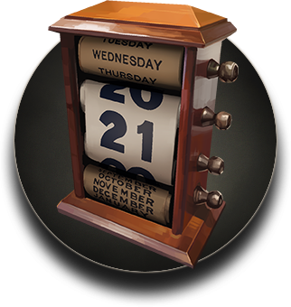

# DayType

(A friendly API for working with dates without the time of day)

The problem that developers regularly encounter is that people often refer to dates without wanting or needing to go down to a specific time of day. For example, ask someone when is their birthday and the reply might be the 20th of October 1997. They won't tell you the exact birth time (if they even know it) because it's not needed. The same goes for many other things which are generally considered all day events. The start of a person's leave, the dates of a festival, Religious holidays, etc.

Swift though, only provides the `Date` type which is an exact point in time, not the generalisation that people think of as a date.

This miss-match between what humans refer to as a "date" and Swift's `Date` often provides endless "fun" for developers with often messy and buggy results as they try to tame the translation from exact points in time to the generalisation that is a day. Especially when dealing with the additional complexity of time zones. 

`DayType` sets out to address this by providing a `Day` type that resolves to a date without going any finer. No hours, no minutes, etc, just a date. This allows code to be simpler because it no longer needs to sanitise the time components, and removes the angst of accidental bugs from unexpected inputs and other data sources.

## Installation

`DayType` is a SPM package, so simply add it as you would any other package.

# Creating a Day

`Day` has a number of convenience initialisers which are pretty self explanatory. If you're familiar with Swift's `Date` you'll also recognise a few similarities:

```swift
init()
init(daysSince1970: DayInterval)
init(timeIntervalSince1970: TimeInterval)
init(date: Date, usingCalendar calendar: Calendar = .current)
init(components: DayComponents)
init(_ year: Int, _ month: Int, _ day: Int)
init(year: Int, month: Int, day: Int) 
```

# Codable

`Day` is `Codable`. Reading and writing it's `.daysSince1970` integer value to and from the decoders and encoders. 

# Property wrappers 

`Day`'s internal value isn't something that external APIs are typically aware of. So to support the typical range of values that external APIs tend to use, `DayType` provides a range of property wrappers that can handle the processing. Each of which provide the relevant `Codable` support for reading `Day` values from JSON and other sources. 

_Note: All of these wrappers support both `Day` and `Day?` properties through the use of the `DayCoable` protocol which is applied to both._

## @EpochDay

Reads and writes `Day` types as epoch integers. For example the JSON data structure:

```json
{
  "dob":856616400
}
```

Can be read by:

```swift
struct MyType: Codable {
  @EpochDay var dob: Day // or Day?
}
```

## @ISO8601Day

Reads and writes `Day` types as [ISO8601](https://en.wikipedia.org/wiki/ISO_8601) date strings. For example:

```json
{
  "dob": "1997-02-22T13:00:00+11:00"
}
```

Can be read by:

```swift
struct MyType: Codable {
  @ISO8601Day var dob: Day // or Day?
}
```

## @CustomISO8601Day<T, Configurator>

Where `T: DayCodable` and `Configurator: ISO8601Configurator`. 

Internally `DayType` uses an `ISO8601DateFormatter` to read and write [ISO8601](https://en.wikipedia.org/wiki/ISO_8601) strings. As there are a variety of ISO8601 formats, this property wrapper allows you to pre-configure the formatter before it is used.

For example:

```json
{
  "dob": "20120202 133323"
}
```

Can be read by:

```swift
enum MinimalFormat: ISO8601Configurator {
    static func configure(formatter: ISO8601DateFormatter) {
        formatter.timeZone = TimeZone(secondsFromGMT: 11 * 60 * 60)
        formatter.formatOptions.insert(.withSpaceBetweenDateAndTime)
        formatter.formatOptions.subtract([.withTimeZone, .withColonSeparatorInTime, .withDashSeparatorInDate])    }
}

struct MyType: Codable {
  @CustomISO8601Day<Day, MinimalFormat> var dob: Day
  // or ...
  @CustomISO8601Day<Day?, MinimalFormat> var dob: Day?
}
```

The `ISO8601Configurator` protocol specifies only a single function which is  `static`. That function is used to configure the formatter used to read and write the date strings. 

# Manipulating Day types

## Operators

There are a variety of functions that can be performed on `Day` types. `Day` has `+`, `-`, `+=` and `-=` operators which can be used to add or subtract a number of days from a day.

For example:

```swift
let day = Day(2000,1,1) + 5 // -> 2000-01-06 
let day = Day(2000,1,1) - 10 // -> 1999-12-21 

let day = Day(2000,1,1)
day += 5 // -> 2000-01-06 

let day = Day(2000,1,1)
day -= 5 // -> 1999-12-21
```

In addition you can also subtract one day from another to get the duration between them.

```swift
Day(2000,1,10) - Day(2000,1,5) // -> 5 days duration. 
```

# DayComponents

Similar to the way `Date` has a matching `DateComponents`, `Day` has a matching `DayComponents`. In this case mostly as a convenient wrapper for passing the individual values for a year, month and day. 

# Other Day functions

## .date(inCalendar:timeZone:) -> Date

Using a passed `Calendar` and `TimeZone`, this function coverts a `Day` to a Swift `Date` with the `Day`'s year, month and day, and a time of `00:00` (midnight). With no arguments this function uses the current calendar and time zone.


## .formatted(_:) -> String

Wrapping `Date.formatted(date:time:)` this function formats a day using the standard formatting specified by the `Date.FormatStyle.DateStyle` styles. The time component of `Date.formatted(date:time:)` is omitted.

# References and thanks

* Can't thank [Howard Hinnant](http://howardhinnant.github.io) enough. His calculations are what I based this framework on.
* Quick thank you to the guys behind the excellent [Nimble test assertion framework](https://github.com/Quick/Nimble).

# Future additions

Obviously there are a large number of useful functions that can be added to this API, many of which could come from various other calculations on [http://howardhinnant.github.io/date_algorithms.html#weekday_from_days](). However I will add these as requested rather than trying to re-implement a large number of possibilities that may not ben needed. So please feel free to request things you need.